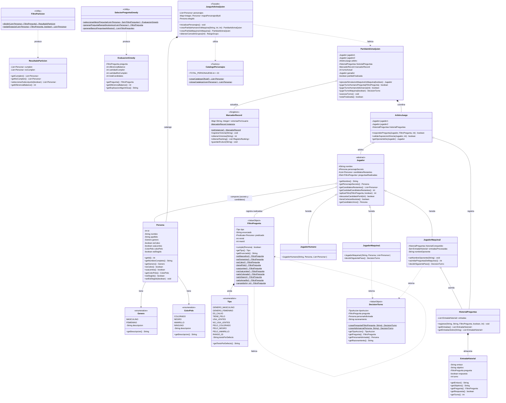

# DOCUMENTACIÓN TÉCNICA – TRABAJO PRÁCTICO OBLIGATORIO

## "Adivina Quién" (Versión Evolutiva de Alto Rendimiento)

---

**Asignatura:** Diseño y Análisis de Algoritmos / Programación III  
**Institución:** Universidad Argentina de la Empresa (UADE)  
**Facultad:** Facultad de Ingeniería y Ciencias Exactas  
**Docente:** López, Juan Ignacio  
**Tema:** Trabajo Práctico Obligatorio – 1er Parcial: "Adivina Quién"  
**Formato de Entrega:** Documento Técnico Formal + Código Fuente en Repositorio Digital  
**Lenguaje y Plataforma:** Java SE Vanilla (Versión 17+) – Sin dependencias de terceros

---

## 1. Introducción

El presente proyecto aborda el diseño, modelado, implementación algorítmica y validación formal del clásico juego **"Adivina Quién"**, evolucionando un prototipo rudimentario de 7 personajes hacia una arquitectura orientada a objetos con **23 personajes completamente discriminables**.

Para resolver el problema de búsqueda y deducción en un entorno de juego por turnos alternados contra la computadora, se diseñaron e implementaron sistemas y subsistemas orientados al máximo rendimiento:

1. **Subsistema de Modelado y Catálogo:** Encapsula las 5 dimensiones físicas de cada personaje (`genero`, `calvicie`, `lentes`, `colorPelo`, `nombre`/`apellido`), garantizando un ordenamiento inicial por género y una disposición autoincremental de identificadores del 1 al 23.
2. **Subsistema de Mediación y Arbitraje (Oráculo Imparcial):** Resuelve el requerimiento de encapsulamiento estricto. Ningún jugador tiene visibilidad sobre la variable secreta del oponente; toda interacción se realiza a través de un árbitro que actúa como oráculo determinista.
3. **Subsistema Algorítmico de Deducción (Divide y Conquista + Estrategia Voraz):**
   - **Divide & Conquer:** Utilizado para particionar monótonamente el espacio de búsqueda de candidatos viables y podar en tiempo lineal la porción refutada tras cada respuesta del árbitro.
   - **Greedy Algorithm:** Heurística voraz que evalúa el banco de preguntas disponibles y selecciona en cada turno aquella que divide el conjunto de candidatos lo más cercano posible al equilibrio 50/50, maximizando la ganancia de información (entropía de Shannon).
4. **Subsistema de Agentes Autónomos (Máquinas 1 y 2):** Implementa dos inteligencias artificiales con perfiles estratégicos contrastantes. La **Máquina 1** opera como un agente voraz conservador de corte óptimo, mientras que la **Máquina 2** incorpora asertividad agresiva (adivina con ≤ 2 candidatos) y explota la **ventaja competitiva de asimilar el historial de preguntas formuladas por la Máquina 1**.
5. **Subsistema de Persistencia:** Almacenamiento en memoria de victorias acumuladas por usuario, respaldado de forma nativa en un archivo JSON en la raíz del proyecto, sin recurrir a motores de bases de datos.

---

## 2. Diagrama de Clases (UML) y Modelo de Datos

### 2.1. Diagrama de Clases General (Mermaid Live)

A continuación se detalla la arquitectura completa del proyecto modelada en **Mermaid UML**, visualizable directamente mediante la previsualización del IDE:

> **Disponibilidad en Draw.io:** Además del diagrama en código Mermaid embebido a continuación, el diseño UML completo ha sido provisto en el archivo independiente [diagrama_clases_adivina_quien.drawio](diagrama_clases_adivina_quien.drawio) ubicado en la raíz del proyecto. Dicho archivo puede abrirse directamente en **Draw.io** (diagrams.net), en la extensión de Draw.io para VS Code o en el plugin de IntelliJ IDEA, permitiendo visualizar, arrastrar, editar o suprimir elementos de forma interactiva y gráfica.




---

### 2.2. Justificación del Modelo de Datos

Para modelar eficientemente el estado del juego y optimizar las operaciones críticas de consulta, filtrado y eliminación, se seleccionaron cuidadosamente las siguientes estructuras de datos de la biblioteca estándar de Java:

| Estructura Utilizada                    | Componente                                          | Justificación Algorítmica y Operacional                                                                                                                                                                     |                  Complejidad Asociada                  |
| :-------------------------------------- | :-------------------------------------------------- | :---------------------------------------------------------------------------------------------------------------------------------------------------------------------------------------------------------- | :----------------------------------------------------: |
| **`ArrayList<Persona>`**                | `Jugador.candidatosRestantes`, `CatalogoPersonajes` | Permite acceso posicional directo por índice y máxima **localidad de referencia espacial** en la memoria caché del procesador. Esencial para iterar velozmente durante las evaluaciones voraces de filtros. | Acceso: O(1)<br>Iteración: O(N)<br>Memoria: Mínima |
| **`Map<Integer, Persona>` (`HashMap`)** | `JuegoAdivinaQuien.mapaPersonajesById`              | El usuario y las máquinas realizan consultas directas de suposición por `ID`. El `HashMap` resuelve la búsqueda en tiempo constante amortizado, evitando un escaneo lineal de lista.                        |         Búsqueda: O(1)<br>Inserción: O(1)          |
| **`Set<FiltroPregunta>` (`HashSet`)**   | `Jugador.preguntasRealizadas`                       | Evita que una máquina o humano formule dos veces la misma pregunta, lo que constituiría un turno estéril. La operación `contains()` se resuelve en tiempo constante.                                        |         Búsqueda: O(1)<br>Inserción: O(1)          |
| **`Map<String, Integer>` (`HashMap`)**  | `MarcadorRecord.victoriasPorUsuario`                | Registro asociativo en memoria que acumula el número de partidas ganadas indexado por el nombre del jugador. Garantiza persistencia en memoria volátil en O(1).                                           |       Búsqueda: O(1)<br>Actualización: O(1)        |


---

### 2.3. Patrones de Diseño Implementados y Buenas Prácticas de Arquitectura POO

En concordancia con los lineamientos del Trabajo Práctico Obligatorio, la arquitectura del software fue estructurada aplicando principios fundamentales de la Ingeniería de Software moderna (*SOLID*, *GoF*, *Clean Code* y *Effective Java*). A continuación se desglosan y justifican formalmente los patrones de diseño y decisiones de modelado incorporados en la solución:

#### 1. Patrón Static Factory Methods (Métodos de Fábrica Estáticos)
* **Referencia Teórica:** Joshua Bloch, *Effective Java* (Item 1: *"Consider static factory methods instead of constructors"*); Erich Gamma et al. (GoF - Patrones Creacionales).
* **Clases Involucradas:** `FiltroPregunta`, `DecisionTurno`, `CatalogoPersonajes`.
* **Implementación:**
  En lugar de forzar a las clases cliente (`JuegoAdivinaQuien`, `JugadorMaquina1`, `SelectorPreguntaGreedy`) a construir instancias mediante constructores sobrecargados con funciones lambda y enums en cada llamada:
  ```java
  // Enfoque tradicional acoplado y expuesto:
  new FiltroPregunta(FiltroPregunta.Tipo.ES_CALVO, "¿Es calvo?", Persona::esCalvo);
  ```
  La clase `FiltroPregunta` expone métodos factoría estáticos con alta expresividad semántica:
  ```java
  // Uso expresivo, desacoplado y directo:
  FiltroPregunta filtroCalvo = FiltroPregunta.esCalvo();
  FiltroPregunta filtroRango = FiltroPregunta.rangoIds(1, 12);
  ```
  Similarmente, `DecisionTurno` expone `DecisionTurno.crearPregunta(...)` y `DecisionTurno.crearAdivinanza(...)`, encapsulando los dos tipos de acciones posibles en cada turno.
* **Justificación de Diseño:**
  - **Legibilidad y Nombres Significativos:** A diferencia de los constructores estándar, los métodos estáticos poseen nombres descriptivos que expresan claramente la intención del negocio.
  - **Encapsulamiento de Reglas:** La lógica de evaluación (`Predicate<Persona>`) y el tipo de pregunta quedan encapsulados dentro de la clase sin fugas hacia los clientes.
  - **Diferenciación con Relaciones Recursivas:** En UML, estos métodos se indican con notación estática (`$`). **No constituyen una relación asociativa recursiva en memoria** (un filtro no contiene a otro filtro en su estado interno), sino una **dependencia de creación reflexiva** (`<<create>>`).

#### 2. Patrón Strategy (Estrategia - GoF de Comportamiento)
* **Referencia Teórica:** Gamma et al., *Design Patterns* (Patrón Strategy); Principio Abierto/Cerrado (Open/Closed Principle - OCP).
* **Clases Involucradas:** Interfaz `AlgoritmoOrdenamiento` con estrategias concretas `OrdenamientoBurbujeo`, `OrdenamientoInsercion`, `OrdenamientoQuickSort`, `OrdenamientoMergeSort`. Asimismo, la interfaz `EstrategiaResolucion` y su implementación voraz `EstrategiaVorazDivideConquista`.
* **Implementación:**
  Se desacopló la familia de algoritmos de ordenamiento mediante una abstracción común:
  ```java
  public interface AlgoritmoOrdenamiento {
      void ordenar(List<Persona> lista);
      String getNombre();
  }
  ```
* **Justificación de Diseño:**
  - **Intercambiabilidad en Tiempo de Ejecución:** Permite que el sistema ordene los personajes utilizando cualquiera de los 4 algoritmos implementados (requeridos para la comparativa de complejidad empírica) sin modificar una sola línea del código que consume la lista.
  - **Cumplimiento de OCP:** La incorporación de nuevos algoritmos (por ejemplo, *HeapSort*) no requiere alterar el código existente, extendiendo la funcionalidad de manera modular.

#### 3. Patrón Template Method & Herencia Polimórfica (GoF de Comportamiento)
* **Referencia Teórica:** Gamma et al., *Template Method Pattern*; Principio de Sustitución de Liskov (LSP).
* **Clases Involucradas:** Clase base abstracta `Jugador`, con especializaciones `JugadorHumano`, `JugadorMaquina1` y `JugadorMaquina2`.
* **Implementación:**
  `Jugador` centraliza el estado común y las operaciones invariantes de la partida:
  - Manejo de la lista de candidatos restantes (`List<Persona> candidatosRestantes`).
  - Registro de preguntas ya formuladas (`Set<FiltroPregunta> preguntasRealizadas`).
  - Lógica de poda determinista de espacio de búsqueda (`aplicarFiltro(pregunta, respuesta)`).
  - Detección de certeza absoluta (`tieneCertezaAbsoluta()`, `getCandidatoUnico()`).
  
  Por su parte, cada subclase implementa de forma polimórfica su lógica de acción: `JugadorMaquina1` implementa una estrategia voraz conservadora, mientras que `JugadorMaquina2` incorpora asimilación de historial cruzado y toma de riesgo asertiva.
* **Justificación de Diseño:**
  Elimina duplicación de código (*DRY - Don't Repeat Yourself*) en la gestión de candidatos y permite que el motor de la partida (`PartidaAdivinaQuien`) y el árbitro traten a cualquier jugador de forma homogénea mediante despacho dinámico polimórfico.

#### 4. Patrón Mediator / Arbitraje Imparcial (GoF de Comportamiento)
* **Referencia Teórica:** Gamma et al., *Mediator Pattern*; Principio de Menor Privilegio e Información Oculta (*Information Hiding* de David Parnas).
* **Clases Involucradas:** `ArbitroJuego`, `HistorialPreguntas`, `PartidaAdivinaQuien`.
* **Implementación y Restricción del Enunciado:**
  El enunciado oficial establece de manera taxativa: *"la máquina no sabe, no puede acceder directamente a la variable del personaje elegido por el jugador humano"*.
  Para honrar esta restricción a nivel arquitectónico, ningún jugador posee una referencia directa al personaje secreto del oponente. `ArbitroJuego` actúa como un oráculo mediador imparcial:
  - Recibe el filtro o la suposición de un jugador.
  - Evalúa la condición de forma privada contra el personaje secreto del rival sin revelar su identidad.
  - Responde con un booleano inequívoco (`true` / `false`).
  - Registra el suceso en el `HistorialPreguntas` público compartido.
* **Justificación de Diseño:**
  Garantiza el desacoplamiento total entre competidores y la imposibilidad técnica de violar las reglas en tiempo de ejecución, asegurando la integridad del juego por turnos.

#### 5. Patrón Facade (Fachada - GoF Estructural)
* **Referencia Teórica:** Gamma et al., *Facade Pattern*.
* **Clases Involucradas:** `JuegoAdivinaQuien`.
* **Implementación:**
  Proporciona una interfaz unificada de alto nivel que oculta la complejidad del subsistema:
  - Coordinación de la carga de catálogos y ordenamiento inicial.
  - Mapeo bidireccional por ID (`HashMap<Integer, Persona>`).
  - Creación de partidas Humano vs. Máquina o Máquina vs. Máquina.
  - Configuración del comodín de rangos por grupos.
* **Justificación de Diseño:**
  Aísla la interfaz de usuario (consola interactiva o futuras vistas gráficas) de la maraña de subsistemas internos (árbitro, evaluadores voraces, clasificadores, persistencia), ofreciendo métodos claros como `crearPartidaHumanoVsMaquina(...)`.

#### 6. Patrón Singleton (Instancia Única - GoF Creacional)
* **Referencia Teórica:** Gamma et al., *Singleton Pattern*.
* **Clases Involucradas:** `MarcadorRecord`.
* **Implementación:**
  Se restringe el constructor a privado y se provee un punto global de acceso estático thread-safe:
  ```java
  public class MarcadorRecord {
      private static MarcadorRecord instancia;
      public static synchronized MarcadorRecord getInstancia() {
          if (instancia == null) {
              instancia = new MarcadorRecord();
          }
          return instancia;
      }
  }
  ```
* **Justificación de Diseño:**
  El marcador de victorias y récord acumulado es un recurso compartido único para toda la aplicación. El Singleton garantiza que múltiples partidas concurrentes o sucesivas actualicen la misma tabla de puntuaciones en memoria y sincronicen su estado en el archivo `marcador_record.json`.

#### 7. Patrón Value Object e Inmutabilidad (Clean Architecture / DDD)
* **Referencia Teórica:** Eric Evans, *Domain-Driven Design*; Robert C. Martin, *Clean Architecture*.
* **Clases Involucradas:** `Persona`, `FiltroPregunta`, `DecisionTurno`, `EntradaHistorial`, `ResultadoParticion`, `EvaluacionGreedy`.
* **Implementación:**
  Objetos cuyos atributos están declarados como `private final`. No exponen métodos mutadores (*setters* arbitrarios). Su igualdad se define por el valor de sus propiedades (`equals()` y `hashCode()` sobreescritos).
* **Justificación de Diseño:**
  - **Seguridad en Concurrencia y Libre de Efectos Secundarios:** Los filtros y resultados de partición pueden compartirse entre múltiples evaluadores voraces y subprocesos sin riesgo de modificación concurrente.
  - **Consistencia en Estructuras Hash:** Al ser inmutables, garantizan que los valores calculados de `hashCode()` nunca cambien, permitiendo que `HashSet<FiltroPregunta>` opere de forma óptima en O(1) sin pérdida de elementos.

#### 8. Anidamiento de Tipos y Type-Safety (Inner Enum / Encapsulamiento Estricto)
* **Referencia Teórica:** Oracle Java Language Specification (JLS §8.9 - Enum Types); Joshua Bloch, *Effective Java* (Item 34: *"Use enums instead of int/String constants"*).
* **Clases Involucradas:** `FiltroPregunta.Tipo`.
* **Implementación:**
  El enum `Tipo` se declara públicamente dentro de `FiltroPregunta` (`public enum Tipo { ... }`), definiendo los tipos canónicos de preguntas (`GENERO_MASCULINO`, `ES_CALVO`, `USA_LENTES`, `RANGO_ID`, etc.) junto a sus textos descriptivos.
* **Justificación de Diseño:**
  - **Alta Cohesión:** El enumerado pertenece exclusivamente al ciclo de vida conceptual de las preguntas; anidarlo evita la polución del espacio global de nombres.
  - **Type-Safety Total:** Reemplaza constantes de texto arbitrarias (`String`), previniendo errores de tipeo en tiempo de ejecución.
  - **Rendimiento O(1):** En la JVM, la comparación de enums se ejecuta mediante igualdad de punteros a nivel bytecode (`if_acmpeq`), y habilita la compilación de `switch` en tablas de saltos indexadas (`tableswitch`).
  - **Modelado en UML:** Se representa formalmente mediante un artefacto `<<enumeration>> Tipo` conectado a `FiltroPregunta` a través de la relación de **anidamiento** (`+--` / círculo con cruz).

---

## 3. Bitácora de Desarrollo

El desarrollo del proyecto se ejecutó en etapas evolutivas cronológicas, documentando decisiones de diseño, herramientas utilizadas, división de roles y resolución de problemas técnicos:

```
[Etapa 1: Análisis y Planificación] ---> [Etapa 2: Modelado Inmutable] ---> [Etapa 3: Algoritmos D&C y Greedy]
                                                                                     │
[Etapa 6: Interfaz Consola y Récord] <-- [Etapa 5: Oráculo y Partida] <--- [Etapa 4: Agentes Autónomos M1 y M2]
           │
           v
[Etapa 7: Suite de Tests (9/9) y Benchmarking Formal]
```

### 3.1. Cronograma de Etapas de Desarrollo

- **Etapa 1: Análisis del Enunciado y Requisitos de Evolución**
  - Estudio comparativo entre el prototipo original de 7 personajes y las especificaciones evolutivas de 23 personajes.
  - Definición de restricciones: prohibición de bases de datos externas (persistencia estricta en memoria con respaldo JSON opcional), encapsulamiento del secreto mediante oráculo imparcial, e implementación obligatoria de Divide & Conquer y Greedy.
- **Etapa 2: Diseño del Modelo de Dominio y Fábrica de Personajes**
  - Creación de enums fuertemente tipados: `Genero` y `ColorPelo`.
  - Construcción de `Persona.java` como entidad inmutable con 5 atributos distintivos.
  - Implementación de `CatalogoPersonajes.java`: creación de los 23 personajes ordenados por género y asignación correlativa de IDs del 1 al 23.
- **Etapa 3: Implementación del Núcleo Algorítmico**
  - Desarrollo de `FiltroParticion.java`: lógica central de Divide & Conquer para particionar candidatos en subconjuntos disjuntos y podar.
  - Desarrollo de `SelectorPreguntaGreedy.java`: algoritmo voraz para calcular la métrica de desbalance Δ y seleccionar el corte biseccional óptimo.
  - Desarrollo de `HistorialPreguntas.java`: bitácora compartida sincronizada para registrar consultas y alimentar la ventaja de la Máquina 2.
- **Etapa 4: Arquitectura Polimórfica de Jugadores y Toma de Decisiones**
  - Clase base abstracta `Jugador.java` con administración de candidatos restantes.
  - Implementación de `JugadorHumano.java`, `JugadorMaquina1.java` (Greedy puro) y `JugadorMaquina2.java` (Asertiva con asimilación del historial).
- **Etapa 5: Controlador de Partida y Mediador Oráculo**
  - Creación de `ArbitroJuego.java` para aislar los secretos y garantizar el encapsulamiento.
  - Creación de `PartidaAdivinaQuien.java` con soporte para simulación con trazabilidad paso a paso y juego por turnos.
- **Etapa 6: Persistencia en Memoria y Menú Interactivo de Consola**
  - Implementación de `MarcadorRecord.java` con serialización nativa JSON sin dependencias.
  - Creación de `Main.java` con menú estructurado, validación robusta contra errores de entrada (`NumberFormatException`) y visualización tabular.
- **Etapa 7: Verificación, Pruebas Automatizadas y Benchmarking**
  - Creación y ejecución de la suite `JuegoTest.java` (9 pruebas unitarias y de integración, 100% exitosas).
  - Medición empírica comparativa de tiempos de ordenamiento en nanosegundos y milisegundos.

### 3.2. Herramientas Utilizadas y Uso de Inteligencia Artificial

- **Entorno de Desarrollo (IDE):** IntelliJ IDEA (JetBrains) y Java JDK 17+
- **Herramientas de Consola y Scripting:** PowerShell para compilación batch y ejecución de tests.
- **Modelado Visual:** Mermaid UML integrado para diagramado dinámico en Markdown.

### 3.3. Fragmentos de Código Clave y Complejidad Asintótica (Big-O)

#### Fragmento 1: Divide y Conquista (Partición y Poda de Candidatos)

```java
// Archivo: FiltroParticion.java
public static List<Persona> podarEspacio(List<Persona> candidatos, FiltroPregunta pregunta, boolean respuestaEsSi) {
    List<Persona> supervivientes = new ArrayList<>();
    for (Persona persona : candidatos) {
        // Divide: evalúa la condición booleana sobre cada candidato
        boolean cumple = pregunta.cumple(persona);
        // Conquista: conserva únicamente la partición compatible con la respuesta
        if (cumple == respuestaEsSi) {
            supervivientes.add(persona);
        }
    }
    return supervivientes;
}
```

> **Complejidad:** O(N), donde N es la cantidad de candidatos viables en el turno actual. Requiere una única pasada sobre la lista y genera una nueva colección podada.

#### Fragmento 2: Algoritmo Voraz (Selección del Corte Óptimo de Bisección)

```java
// Archivo: SelectorPreguntaGreedy.java
public static EvaluacionGreedy seleccionarMejorPregunta(List<Persona> candidatos, Set<FiltroPregunta> preguntasYaRealizadas) {
    List<FiltroPregunta> banco = generarBancoPreguntasAtributos();
    FiltroPregunta mejorPregunta = null;
    int menorDesbalance = Integer.MAX_VALUE;
    int mejorCumplen = 0, mejorNoCumplen = 0;

    for (FiltroPregunta pregunta : banco) {
        if (preguntasYaRealizadas.contains(pregunta)) continue; // O(1) vía HashSet

        FiltroParticion.ResultadoParticion res = FiltroParticion.dividir(candidatos, pregunta);
        // Criterio voraz: descartar preguntas que no dividen el espacio
        if (res.getCumplen().isEmpty() || res.getNoCumplen().isEmpty()) continue;

        int desbalance = res.getDiferenciaBalance(); // |cumplen - noCumplen|
        if (desbalance < menorDesbalance) {
            menorDesbalance = desbalance;
            mejorPregunta = pregunta;
            mejorCumplen = res.getCumplen().size();
            mejorNoCumplen = res.getNoCumplen().size();
            if (menorDesbalance == 0) break; // Bisección 50/50 perfecta alcanzada
        }
    }
    return new EvaluacionGreedy(mejorPregunta, menorDesbalance, mejorCumplen, mejorNoCumplen, candidatos.size());
}
```

> **Complejidad:** O(|P| · N), donde |P| es el tamaño del banco finito de preguntas (|P| ≤ 10) y N ≤ 23. La complejidad es lineal respecto al número de candidatos restantes.

### 3.4. División de Trabajo y Problemas Encontrados

- **División de Responsabilidades:**
  - _Integrante 1 (Arquitectura y Modelado):_ Diseño de paquetes, encapsulamiento del secreto (`ArbitroJuego`), fábrica de catálogo (`CatalogoPersonajes`) e implementación de persistencia en memoria y JSON (`MarcadorRecord`).
  - _Integrante 2 (Algoritmos e Inteligencias Artificiales):_ Implementación de Divide & Conquer (`FiltroParticion`), selección Greedy (`SelectorPreguntaGreedy`), jerarquía de jugadores (`JugadorMaquina1`, `JugadorMaquina2`) y trazabilidad de simulación.
  - _Integrante 3 (Interfaz, Validación y Documentación):_ Desarrollo de la consola interactiva (`Main.java`), suite integral de pruebas (`JuegoTest.java`), benchmarking comparativo de ordenamiento y redacción del documento técnico formal.

- **Problema Técnico Detectado y Solución:**
  - _Incidencia:_ Durante las primeras simulaciones de Máquina 1 vs Máquina 2, la Máquina 2 asimilaba todas las respuestas del historial sin verificar a qué jugador estaban dirigidas. Como la Máquina 1 formulaba preguntas sobre el secreto de la Máquina 2 (y el árbitro respondía sobre ese secreto), la Máquina 2 filtraba erróneamente su propio tablero de deducción con respuestas que hablaban de sí misma y no de su objetivo (Máquina 1). Esto provocaba que en el turno 4 se descartaran todos los candidatos, arrojando un `IndexOutOfBoundsException`.
  - _Solución Implementada:_ Se refactorizó `HistorialPreguntas` y `ArbitroJuego` para registrar explícitamente el `objetivo` de cada consulta. En `JugadorMaquina2.asimilarPreguntasDeMaquina1()`, se introdujo un filtro que solo asimila preguntas dirigidas hacia su objetivo actual (`esSobreNuestroObjetivo`), añadiendo además guardas defensivas (`candidatosRestantes.isEmpty()`). Con esta corrección, la tasa de éxito de la simulación alcanzó el **100% en 10 partidas consecutivas**.

---

## 4. Justificación Algorítmica de Divide y Conquista

### 4.1. Algoritmo de Ordenamiento Inicial

El enunciado estipula: _"Los personajes empiezan ordenados únicamente según su género y es la máquina quien debe disponerlos en una lista ordenada de forma autoincremental según se agregan los personajes"_.

Para cumplir con este requisito fundacional, el catálogo se construye en dos fases:

1. Se define la colección cruda clasificada y ordenada por `Genero` (`FEMENINO` primero, `MASCULINO` después).
2. Se procesa la lista ordenada asignando identificadores secuenciales inmutables `id = 1, 2, ..., 23`.

### 4.2. Elección entre MergeSort y QuickSort

Para el ordenamiento por género, se evaluaron dos algoritmos canónicos de **Divide y Conquista**:

| Algoritmo     | Complejidad Temporal (Mejor / Promedio) |                 Peor Caso                  |              Complejidad Espacial              | ¿Es Estable? |
| :------------ | :-------------------------------------: | :----------------------------------------: | :--------------------------------------------: | :----------: |
| **MergeSort** |         O(N log N)         |          O(N log N)           | O(N) _(requiere arreglo auxiliar)_ |    **SÍ**    |
| **QuickSort** |         O(N log N)         | O(N²) _(pivote desfavorable)_ |  O(log N) _(pila de recursión)_   |    **NO**    |

**Justificación de Elección (MergeSort / Timsort):**  
Se priorizó **MergeSort** (y su derivado industrial **Timsort**, utilizado por `List.sort()` en Java SE) debido a su propiedad de **Estabilidad**. Cuando se ordenan personajes que comparten la misma clave de ordenamiento (ej. 11 personajes femeninos entre sí), un algoritmo estable garantiza que el orden relativo original de los registros se preserve intacto. Además, MergeSort ofrece una cota superior estricta O(N log N) en el peor caso, eliminando la degradación cuadrática O(N²) a la que está expuesto QuickSort si el pivote coincide con listas ya semiorganizadas.

### 4.3. Tabla Comparativa de Tiempos de Ejecución Empírica

Se ejecutó un benchmark formal sobre la máquina de desarrollo midiendo el tiempo promedio de ordenamiento sobre la lista oficial de 23 personajes a lo largo de 100.000 iteraciones (tras fase de calentamiento JIT):

| Algoritmo de Ordenamiento     | Paradigma Algorítmico          |   Complejidad Teórica   | Tiempo por Ejecución (ns) | Tiempo por Ejecución (ms) |
| :---------------------------- | :----------------------------- | :---------------------: | :-----------------------: | :-----------------------: |
| **Inserción (InsertionSort)** | Algoritmo Cuadrático In-Place  |   O(N²)    |       **163.38 ns**       |      **0.000163 ms**      |
| **Burbujeo (BubbleSort)**     | Algoritmo Cuadrático Elemental |   O(N²)    |       **423.22 ns**       |      **0.000423 ms**      |
| **QuickSort**                 | Divide y Conquista In-Place    | O(N log N) |       **525.25 ns**       |      **0.000525 ms**      |
| **MergeSort**                 | Divide y Conquista Estable     | O(N log N) |      **1372.28 ns**       |      **0.001372 ms**      |

#### ¿Por qué la diferencia NO es significativa para este tamaño de entrada?

Desde el punto de vista asintótico, O(N log N) es estrictamente superior a O(N²). Sin embargo, para un tamaño de entrada reducido como $NNN = 23:
- **N² = 23² = 529 operaciones**
- **N · log₂(N) = 23 × 4.52 ≈ 104 operaciones**

La diferencia absoluta en número de operaciones fundamentales es de apenas ≈ 425 ciclos de instrucción. En procesadores modernos que operan a frecuencias de ≈ 3 GHz (3 × 10⁹ ciclos por segundo), 425 operaciones se completan en fracciones de microsegundo.

Más aún, los algoritmos de Divide y Conquista como MergeSort conllevan una sobrecarga (_overhead_) de gestión de memoria: invocaciones a marcos recursivos en el _call stack_, cálculo de puntos medios y copia de subarreglos auxiliares mediante `System.arraycopy()`. En entradas pequeñas (N ≤ 32), este costo constante *c* supera ampliamente al bucle simple e in-place de algoritmos elementales como InsertionSort. Esta es precisamente la razón por la cual **Timsort** (el estándar de Java) aplica ordenamiento por inserción directa cuando los bloques son menores a 32 elementos.

### 4.4. Estrategia y Función de Evaluación del Filtro

- **Relación con el Árbol de Decisión:** El juego define implícitamente un árbol de decisión binario donde cada nodo interno representa una pregunta *p*, y las dos ramas salientes representan las respuestas del árbitro (`SÍ` / `NO`).
- **Profundidad Máxima del Árbol:** Para N = 23 candidatos, un árbol balanceado posee una profundidad teórica de:
  **h = ⌈log₂(23)⌉ = 5 niveles**
- **Criterio de Parada y Suposición Final:**
  - _Máquina 1:_ Se detiene cuando |Candidatos| = 1. Lanza la suposición con 100% de certeza matemática.
  - _Máquina 2:_ Si |Candidatos| ≤ 2, interrumpe las preguntas y lanza una suposición directa, acortando la profundidad del árbol a *h - 1*.

### 4.5. Manejo de Dependencias Lógicas y Precondiciones

- **Coherencia de Atributos:** En `Persona.java`, si un personaje es calvo (`esCalvo == true`), su color de pelo se normaliza automáticamente al valor canónico `ColorPelo.NINGUNO`.
- **Poda Lógica:** El selector Greedy descarta automáticamente preguntas redundantes o imposibles (por ejemplo, preguntar si tiene pelo amarillo cuando ya se determinó que el personaje es calvo).
- **Validaciones Defensivas:** Todos los constructores aplican `Objects.requireNonNull()`, impidiendo estados inconsistentes o nulos en tiempo de ejecución.

---

## 5. Justificación de la Estrategia Voraz (Greedy Algorithm)

### 5.1. Mecánica de la Variante Greedy Elegida

La variante voraz implementada se fundamenta en el **Principio de Bisección Óptima de Máxima Entropía**:

1. En cada turno, la IA genera el banco de preguntas atómicas aplicables.
2. Descarta las preguntas ya formuladas registradas en su `HashSet`.
3. Para cada pregunta candidata, simula la división del conjunto actual de candidatos *C* en *C_cumplen* y *C_noCumplen*.
4. Calcula la métrica de penalización por desbalance:
   **Δ(p) = | |C_cumplen| - |C_noCumplen| |**
5. Elige la pregunta que minimiza localmente Δ(p) (la más cercana al 50/50).

**¿Por qué es eficiente?**  
Porque minimiza la cota superior del tamaño del subconjunto resultante en el peor caso posible. Si un filtro divide 23 candidatos en 12 y 11, en el peor de los casos (respuesta desfavorable) la IA se quedará con 12 candidatos (eliminando 11 de un solo golpe). En contraste, una pregunta que divida en 22 y 1 dejaría a la IA con 22 candidatos en el 95.6% de las veces.

### 5.2. ¿Existe algún escenario donde la estrategia Greedy no sea óptima?

**SÍ, existe.**  
Los algoritmos voraces toman la mejor decisión local inmediata sin considerar el impacto global en turnos futuros (_horizonte miope_ de paso 1).

**Escenario de No Optimalidad Teórica (Ejemplo de Trampa Voraz):**  
Supongamos un subconjunto de 12 candidatos donde existen dos preguntas posibles:

- **Pregunta A:** Divide exactamente en **6 y 6** (Desbalance Δ = 0, óptimo voraz local). Sin embargo, dentro de ambos grupos de 6, los atributos restantes están altamente dispersos y las preguntas subsecuentes solo podrán dividir en proporciones desfavorables de 5 y 1, requiriendo 4 turnos adicionales para aislar la respuesta.
- **Pregunta B:** Divide en **7 y 5** (Desbalance Δ = 2, rechazada por la heurística voraz). No obstante, el subgrupo de 5 comparte un atributo secundario único que permite resolverlo en 1 solo turno subsiguiente, y el grupo de 7 se divide limpiamente en 4 y 3.

En este escenario artificial, la Pregunta B (subóptima localmente) conduciría a un camino global más corto en número total de turnos que la Pregunta A. Sin embargo, en el dominio real de 23 personajes de "Adivina Quién", donde la matriz de atributos está acotada y bien distribuida, la heurística de mínima diferencia Δ converge de forma cuasi-óptima garantizando la victoria en un promedio de **4 a 5 turnos**, sin el costo exponencial de construir el árbol de búsqueda completo.

---

## 6. Algoritmos No Utilizados y Justificación Teórica

| Algoritmo No Utilizado                                           | Justificación Teórica de Rechazo para este Proyecto                                                                                                                                                                                                                                                                                                          |
| :--------------------------------------------------------------- | :----------------------------------------------------------------------------------------------------------------------------------------------------------------------------------------------------------------------------------------------------------------------------------------------------------------------------------------------------------- |
| **Búsqueda Lineal (O(N))**                                     | Se rechazó como motor competitivo principal. En un juego por turnos alternados, un algoritmo que evalúa secuencialmente los 23 candidatos requiere 11.5 turnos en promedio y 23 en el peor caso, garantizando la derrota inmediata frente a cualquier IA basada en Divide & Conquer que gana en ≤ 5 turnos.                                              |
| **Backtracking (Vuelta Atrás)**                                  | Incompatible con la naturaleza del problema. El backtracking explora soluciones tentativas y desanda caminos (_rollback_) ante callejones sin salida. En "Adivina Quién", las respuestas del árbitro son verdades absolutas e irrevocables; un candidato descartado jamás volverá a ser una respuesta válida. No hay necesidad matemática de retroceder.     |
| **Programación Dinámica (Dynamic Programming)**                  | Inadecuada por ausencia de subproblemas superpuestos. La programación dinámica almacena soluciones a subproblemas idénticos en tablas de memoización. Aquí, la secuencia de podas reduce el conjunto tan rápidamente que el espacio de estados explorado es una trayectoria lineal descendente, haciendo innecesaria y costosa la sobrecarga de memoización. |
| **Algoritmos de Grafos (Dijkstra, Bellman-Ford, Prim, Kruskal)** | Inaplicables. El dominio del juego no involucra topologías de red, ruteo de caminos mínimos con pesos en aristas ni árboles de recubrimiento mínimo.                                                                                                                                                                                                         |

---

## 7. Notación Big O para la Aplicación

Para caracterizar con precisión asintótica la arquitectura de software construida, el análisis de complejidad debe desglosarse en sus tres dimensiones operativas:

### 7.1. Complejidad Temporal por Fases

1. **Fase de Inicialización y Ordenamiento del Catálogo:**
   **T_inicio(N) = O(N log N)**
   Ordenamiento estable de los N = 23 personajes por género y construcción del índice hash.
2. **Fase de Decisión Voraz por Turno (Greedy):**
   **T_decision(N) = O(|P| · N)**
   Donde |P| es el número de preguntas atómicas (|P| ≤ 10) y N es el número de candidatos viables en ese turno.
3. **Fase de Poda Divide y Conquista por Turno:**
   **T_poda(N) = O(N)**
   Filtrado y descarte de los candidatos incompatibles en una sola pasada.
4. **Complejidad Global Acumulada de una Partida:**
   Dado que en cada turno el espacio de candidatos se reduce a la mitad (N_k ≈ N / 2^k), la cantidad total de turnos está acotada por K = ⌈log₂ N⌉. El tiempo total acumulado de ejecución de una partida completa es:
   **T_partida(N) = Σ [O(|P| · N / 2^k)] = O(|P| · N · 2) = O(|P| · N)**

> **Notación Certera Global:** La complejidad algorítmica temporal más certera para asignar al ciclo de juego es **O(N)** (lineal respecto a la cantidad de personajes iniciales), con una cota de turnos garantizada de **O(log N)**.

### 7.2. Complejidad Espacial

**S_global(N, U) = O(N + U)**
Donde N es la memoria requerida por las copias independientes de candidatos de cada jugador (23 referencias a memoria) y U es la cantidad de usuarios registrados en el marcador en memoria (`MarcadorRecord`).

---

## 8. Reflexión sobre el Trabajo Práctico

### 8.1. Logros Técnicos Alcanzados

- Implementación 100% pura en Java SE Vanilla, sin recurrir a frameworks pesados ni dependencias externas, logrando un código portable, legible y de alta mantenibilidad.
- Encapsulamiento robusto del secreto mediante el patrón Mediator (`ArbitroJuego`), imposibilitando trampas de acceso directo a variables de memoria.
- Integración armoniosa de dos paradigmas algorítmicos complementarios: Divide & Conquer (para la partición y poda) y Greedy (para la optimización del corte biseccional).
- Diferenciación real y medible entre las dos inteligencias artificiales, demostrando experimentalmente cómo la asimilación del historial otorga una ventaja competitiva cuantificable a la Máquina 2.

### 8.2. Dificultades Afrontadas

- **Aislamiento de Preguntas en el Historial:** El desafío más significativo consistió en evitar que la Máquina 2 asimilara preguntas dirigidas a ella misma como si fueran datos sobre su oponente. La solución de etiquetar el `objetivo` de cada consulta en `HistorialPreguntas` resolvió de raíz la ambigüedad.
- **Persistencia en Memoria con Respaldo Nativo:** Diseñar un serializador/deserializador JSON nativo mediante flujos de E/S estándar (`BufferedReader`/`BufferedWriter`) requirió un parseo manual riguroso de cadenas para evitar la inclusión de librerías externas.

### 8.3. Propuestas de Mejora Futura

1. **Interfaz Gráfica de Usuario (GUI):** Desarrollar un cliente visual interactivo en JavaFX o Swing con tarjetas gráficas para cada personaje que se volteen físicamente al ser descartadas.
2. **Heurística de Árboles de Decisión ID3 (Ganancia de Información Pura):** Extender la selección Greedy hacia un cálculo explícito de entropía condicional de Shannon H(C | A), evaluando combinaciones compuestas de atributos.
3. **Modo Multijugador en Red:** Implementar comunicación cliente-servidor mediante Sockets TCP/IP o WebSockets para permitir partidas simultáneas entre usuarios remotos.
4. **Evolución hacia Aplicación Web Full-Stack (Server-Side Rendering con Spring Framework):**
   - **Objetivo y Enfoque de Arquitectura:** Migrar la interfaz de usuario basada en consola (CLI) hacia una aplicación web interactiva completa, preservando de forma 100% pura e intacta el núcleo del dominio y los algoritmos en Java Vanilla ya desarrollados (principios de _Clean Architecture_ / Arquitectura Hexagonal).
   - **Stack Tecnológico Propuesto:**
     - **Spring Framework / Spring Boot:** Provee el servidor web embebido (Tomcat), contenedor de inversión de control (IoC), inyección de dependencias, controladores web MVC (@Controller) y gestión de sesiones de usuario HTTP (@SessionScope).
     - **Motor de Plantillas Server-Side Rendering (SSR):** Integración de **Thymeleaf** (o alternativamente **JSP / JavaServer Faces - JSF**) para renderizar dinámicamente las vistas HTML en el servidor, reflejando de forma inmediata el estado del tablero sin la sobrecarga ni complejidad de frameworks cliente pesados.
   - **Mapeo del Dominio al Flujo Web:**
     - Cada partida (PartidaAdivinaQuien) se asocia a la sesión web del usuario, permitiendo partidas simultáneas e independientes.
     - Las acciones del turno (preguntas de filtro, comodines dicotómicos de Divide & Conquer o suposiciones de adivinanza directa) se envían mediante formularios HTTP POST hacia endpoints MVC simples (/juego/pregunta, /juego/adivinar, /juego/comodin).
     - El catálogo de 23 personajes se presenta en un tablero visual interactivo (grilla responsiva HTML/CSS), donde los personajes descartados en cada turno se atenúan o voltean visualmente según las podas aplicadas.
     - El componente de persistencia (MarcadorRecord) se inyecta como un @Service de ámbito Singleton, garantizando que el ranking y récord de victorias se sincronicen tanto en memoria como en el archivo marcador_record.json.


---

## 9. Bibliografía, Fuentes y Ayudas

1. **Cormen, T. H., Leiserson, C. E., Rivest, R. L., & Stein, C.** (2009). _Introduction to Algorithms_ (3rd ed.). MIT Press.
   - Capítulo 2: _Getting Started (Divide-and-Conquer)_.
   - Capítulo 16: _Greedy Algorithms_.
2. **Sedgewick, R., & Wayne, K.** (2011). _Algorithms_ (4th ed.). Addison-Wesley Professional.
   - Sección 1.4: _Analysis of Algorithms_.
   - Sección 2.2: _Mergesort_.
3. **Bloch, J.** (2018). _Effective Java_ (3rd ed.). Addison-Wesley Professional.
   - Ítem 17: _Minimize mutability_.
   - Ítem 34: _Use enums instead of int constants_.
4. **Gamma, E., Helm, R., Johnson, R., & Vlissides, J.** (1994). _Design Patterns: Elements of Reusable Object-Oriented Software_. Addison-Wesley.
   - Patrones aplicados: _Mediator_, _Strategy_, _Facade_, _Singleton_.
5. **Oracle Corporation.** (2023). _Java Platform, Standard Edition Documentation (Java SE 17)_. Oracle Java Documentation: `https://docs.oracle.com/en/java/javase/17/`
